# md-creation

npm-workspaces monorepo.

| Workspace | Path      | Description       |
| --------- | --------- | ----------------- |
| md-web    | `web/`    | Next.js front end |
| md-studio | `studio/` | Sanity Studio     |

## Getting started

```bash
npm install
npm run dev          # starts the web app
npm run dev:studio   # starts the Sanity Studio
```

Other root scripts:

```bash
npm run build      # build every workspace
npm run lint       # lint every workspace
npm run typecheck  # type-check every workspace
```

Run a script in one workspace with `npm run <script> --workspace <name>`, e.g.
`npm run deploy --workspace studio`.

## Markdown for agents

Every page in `web/` is a Source Page listed in `web/app/sitemap.ts`. An Ingest Run
reads that sitemap, extracts each page's main content and hands it to **Sanity Agent
Actions**, which generate the markdown and write the published `markdownPage` document
(`main` uses a deterministic turndown converter instead).

| URL | What you get |
| --- | --- |
| `/about` | HTML, with `<link rel="alternate" type="text/markdown" href="/about.md">` |
| `/about` with `Accept: text/markdown` | The markdown version |
| `/about.md` (`/index.md` for `/`) | The markdown version, explicit URL |
| `/sitemap.md` | Index of every published Markdown Page |

### How it works

```mermaid
flowchart TD
    subgraph Trigger
        deploy[Production deploy] -->|deployment.promoted webhook| hook["/api/webhooks/vercel"]
        curl["curl -X POST /api/ingest"] --> manual["/api/ingest"]
    end

    hook --> run[Ingest Run]
    manual --> run

    subgraph Ingest["Ingest Run (web/lib/ingest)"]
        run --> sitemap["GET /sitemap.xml"]
        sitemap -->|each path| fetch["GET page as text/html"]
        fetch --> extract["Extract main content\nhash title + description + HTML"]
        extract --> compare{Hash unchanged\nand not forced?}
        compare -->|yes| skip[Skip]
        compare -->|no| actions["Sanity Agent Actions\npatch: metadata\ngenerate: markdown"]
        run --> stale["Delete markdownPage docs\nfor paths no longer in sitemap"]
        run --> ctx["Sync Sanity Context doc\ninstructions = page index"]
    end

    actions -->|published| store[("Sanity dataset\nmarkdownPage")]
    stale --> store
    ctx --> store

    subgraph Serve["Serving (web/app)"]
        md["/slug.md"] --> handler["/md/[[...path]] route"]
        accept["/slug with Accept: text/markdown"] -->|rewrite| handler
        idx["/sitemap.md"] --> handler
        handler --> store
    end

    store --> mcp["Sanity Context MCP endpoint\n(read token)"]

    agent1[HTTP agent / crawler] --> md
    agent1 --> accept
    agent1 --> idx
    agent2[MCP agent] --> mcp
```



1. A production deploy fires the Vercel webhook (or you call `/api/ingest` by hand).
2. The Ingest Run reads `sitemap.xml`, fetches each page as HTML, extracts `<main>` and hashes it.
3. Unchanged pages are skipped. Changed or new pages go to Sanity Agent Actions: a `patch`
   writes the exact metadata, a `generate` writes the `markdown` field, both to the published
   document.
4. Pages that left the sitemap have their `markdownPage` deleted, and the Sanity Context
   document's instructions are rewritten with the current page index.
5. Agents read the result either over HTTP (`/slug.md`, content negotiation, `/sitemap.md`)
   or over MCP through the Sanity Context endpoint.

### Setup

1. Copy `web/.env.example` to `web/.env.local` and fill it in (Sanity Editor token,
   `INGEST_SECRET`, Vercel webhook secret and project id, `NEXT_PUBLIC_SITE_URL`,
   `SANITY_SCHEMA_ID` from `npx sanity schema list`).
2. Deploy the schema: `cd studio && npx sanity@latest schema deploy`.
3. Run the web app (`npm run dev`). The ingest fetches its own pages, so the app must be up.

### Trigger an Ingest Run

```bash
curl -s -X POST -H "Authorization: Bearer $INGEST_SECRET" http://localhost:3000/api/ingest | jq
```

In production a Vercel account webhook (Deployment Promoted / Deployment Succeeded, scoped
to this project) posts to `/api/webhooks/vercel` after every production deploy.

### Sanity Context (MCP access)

Every Ingest Run also keeps a published Sanity Context document (slug `site-pages`,
scoped to `markdownPage`) in sync, so agents that speak MCP can query the same pages
directly. The endpoint needs a server-side **read** token:

```bash
curl -X POST "https://api.sanity.io/v2026-09-02/context/mcp/5ouc347b/production/site-pages" \
  -H "Authorization: Bearer $SANITY_API_READ_TOKEN" -H "Content-Type: application/json" \
  -d '{"jsonrpc":"2.0","id":1,"method":"tools/list"}'
```

`GET .../site-pages/initial-context` with the same header returns the schema overview plus
the ingest-maintained page index, which works as an auto-updated `llms.txt` for agents.
